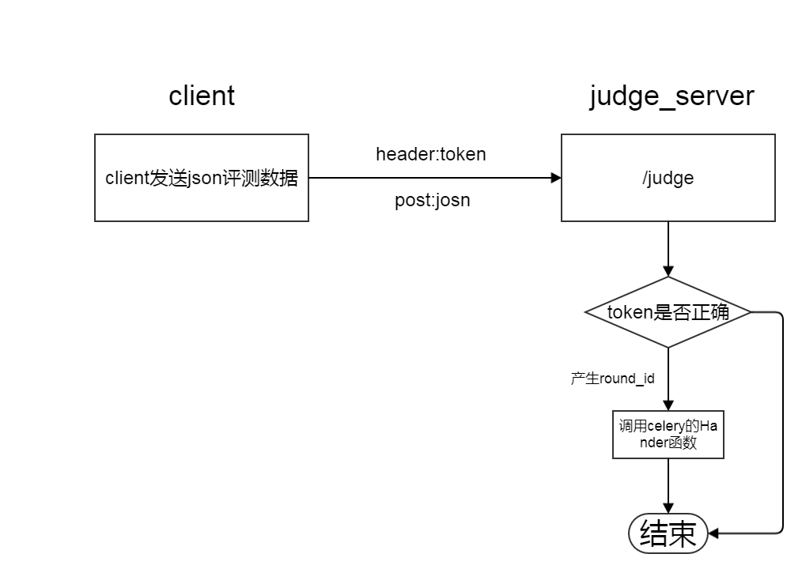

# rJudge

## 快速安装

暂缺

## 设定

```
vim run.sh
```

## 安装:

基本过程如下:

 1. clone这个代码,安装docker,可以使用`aliyun`的docker[加速器](https://cr.console.aliyun.com/?spm=5176.100239.blogcont29941.12.fOsBW8)
 2. 修改rsync,token的相关参数,建立data文件夹
  - 修改`run.sh`下的rsync的用户和密码
  - 修改`run.sh`下的token的密码
 3. 输入命令:`docker build -t rjudge .`,创建images
 4. `sudo docker run -it -v {你的data地址}:/judge_server/data -p 4999:4999 -p 873:873 -d rjudge`

具体安装方法看下面

## 特性

 - 使用rsync来同步测试数据
 - 使用token
 - 定时删除不用的测试文件
 - 使用qdoj的测评机为后台
 - 使用celery作为评测队列

# 安装与使用

## 1.修改Token:

在run.sh里修改token
```
#修改mytoken为你自己的token
echo "mytoken" > /var/www/rjudge/token.txt
```

## 2.修改rsync的密码

在`run.sh`里修改rsync的用户与密码

```
# rsync 的密码,
echo "server:5978" >/etc/rsyncd.secrets
```
## 上传数据:

使用`rsync`来上传数据

修改`run.sh`里的rsync用户和密码
```
# rsync 的密码,
echo "server:5978" >/etc/rsyncd.secrets
```

### 同步数据的方法1:使用rsync


```
#建立一个密码文件
sudo echo 5978 > /etc/rsyncd.secret
sudo chmod 600 /etc/rsyncd.secret
sudo chown root:root /etc/rsyncd.secret
sudo rsync --port 8080 --password-file=/etc/rsyncd.secret -av /databack/ server@<ip>::data
```

### 同步数据的方法:使用lsync

使用lsync可以自动同步

ubuntu 下安装lsyncd

```
sudo apt-get install lsyncd
```

```
#建立一个密码文件
sudo echo 5978 > /etc/rsyncd.secret
# 密码文件可以不在这个路径
sudo chmod 600 /etc/rsyncd.secret
sudo chown root:root /etc/rsyncd.secret
```

配置文件`/etc/lsyncd.conf`

```
settings {
    logfile      ="/var/log/lsyncd.log",
    statusFile   ="/tmp/lsyncd.status",
    inotifyMode  = "CloseWrite",
    maxProcesses = 10,
    statusInterval = 1
}

sync {
    default.rsync,
    source    = "/home/server1/test/data/",
    target    = "server@localhost::data",
    delay     = 15,
    rsync     = {
        binary    = "/usr/bin/rsync",
        archive   = true,
        compress  = true,
        verbose   = true,
        password_file = "/etc/rsyncd.secret"
    }
}
```

启动:`sudo lsyncd  /etc/lsyncd.conf`

根据你的实际情况修改参数

参数的含义请看:https://axkibe.github.io/lsyncd/manual/config/layer4/

## 请求测试的方法


先同步评测数据,然后使用http的post方法请求评测

**注意:**所有的请求头都要带有一个`token`头,

使用`nodejs`的`requests`模块
```node
headers = {
  token:"your_token"
}
requests.post(url, json=data, headers).json()
```

请求地址:`http://your_judge_server_ip/judge`

请求的json数据
```json
{
  "lang": "cpp",//c cpp pas
  "code": "int main() { return 0; }",
  "max_time": 1000,
  "max_memory": 256,//mb
  "problem_id": "1000",
  "r_url":",",//要返回数据的地址
  "judge": "fcmp",
  "revert":{//返回数据的时候把这个部分同样返回
  }
}
```

### 请求数据的含义

 - `lang`:请求评测代码的类型,可以是:
   - `c`:c语言
   - `cpp`:c++语言
   - `pas`:pascal语言
 - `code`:请求评测的代码内容
 - `max_time`:最大时间限制,单位`ms`
 - `max_memroy`:最大内存限制,单位`mb`
 - `problem_id`:测试数据的id,默认的数据文件夹:`/judge_server/data/`,如果`problem_id:1000`,为会就会去找`/judge_server/data/1000/`下面的测试数据

### 测试数据命名规范

输入文件:`<name><num>.in`,
输出文件:`<name><num>.out`

其中`<num>`可以从`0`或`1`开始,文件的格式:`unix`,编码:`utf-8 无bom`


比如下面的命名是正确的
```
aplusb1.in aplusb1.out
aplusb2.in aplusb2.out
aplusb3.in aplusb3.out
```

**高级**:具体分析数据文件名的代码在:`core/utils.py`里的`import_data`函数

### 返回数据

If something is wrong (data is missing or some part of request is missing), server will return:
```json
{
  "status": "reject"
}
```
Otherwise, `status` will be `received`.

Then, submission will be under processing. If `COMPILE_ERROR` occurred:
```json
{
  "id": 302,
  "message": "... In function 'int main()':\n/ju...",
  "verdict": 6,
  "status": "received"
}
```

Otherwise,
```json
{
  "id": 304, 
  "memory": 3052, 
  "status": "received", 
  "time": 588, 
  "verdict": 0,
  "detail": [{"count": 1, "memory": 2944, "time": 16, "verdict": 0}, {"count": 2, "memory": 2944, "time": 16, "verdict": 0}]
}
```

"verdict"数据的含义如下:
```python
WRONG_ANSWER = -1
ACCEPTED = 0
CPU_TIME_LIMIT_EXCEEDED = 1
REAL_TIME_LIMIT_EXCEEDED = 2
MEMORY_LIMIT_EXCEEDED = 3
RUNTIME_ERROR = 4
SYSTEM_ERROR = 5
COMPILE_ERROR = 6
IDLENESS_LIMIT_EXCEEDED = 7
SUM_TIME_LIMIT_EXCEEDED = 8
```

Okay, that pretty much nails it! Good luck!


## 评测机运行流程图

**http请求过程**



**测评过程**

其中`roundsetting`主要是产生各种参数,产生的参数如下

 - `revert`
 - `r_url`
 - `judge_indicator`
 - `code`
 - `max_time`
 - `max_memory`
 - `problem_id`
 - `round_id`:一个随机的字符串,`Handler`类初始化时传递过来
 - `data_dir`:和`problem_id`行成的评测数据路径
 - `round_dir`:和`round_id`行成的临时测评路径
 - `language_settings`:`languages.py`里对应的语言设定
 - `src_name`
 - `exe_name`
 - `src_path`
 - `exe_path`
 - `compile_out_path`
 - `compile_log_path`
 - `compile_cmd`
 - `seccomp_rule_name`

如果没有找到`data_dir`对应的路径,会出错


