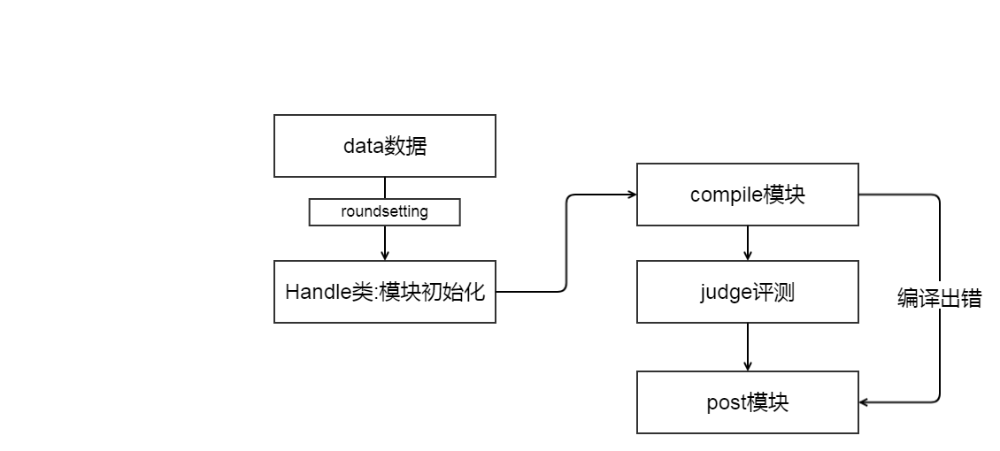

## 运行过程

```
compile ---> group(judge) -- >send_message
```


## API设计

### 发送评测数据:

 - method:post
 - json格式:

```
{
   "max_time":1000,
   "max_memory":128*, //mb
   "problem_id":1, // uid,cid
   "lang":'cpp', //c,cpp,pas
   "code":'# include <cstdio>', //代码
   "r_url":'192.168.0.233:3000/data'//返回结果的地址,
   "judger_indicator":"fcmp",//批明用来比较结果和答案的程序
   "revert":{ // 需要返回的信息
    _id:"xxx" 等等
   }
}
```

### 接收的数据

格式:json

如果compile error

```
{
    "message":compile_error_message
    "verdict":COMPILE_ERROR/6
    revert:{ // 你发的是什么样,这里返回的就是什么样
    }
}
```

如果正常测试结束

```
{
    "result":[]
    "verdict":0
    revert:{ // 你发的是什么样,这里返回的就是什么样
    }
}
```
返回的


## 流程图


